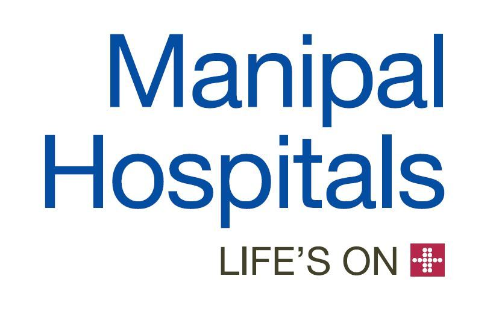
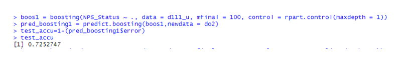

# Predicting Net Promoter Score(NPS) using Manipal Dataset

### Table of contents
* [Introduction](#introduction)
* [Problem Statement](#problem-statement)
* [Data Source](#data-source)
* [Technologies](#technologies)
* [Type of Data](#type-of-data)
* [Data Pre-processing](#data-pre-processing)
* [Algorithms Implemented](#algorithms-implemented)
* [Steps Involved](#steps-involved)
* [Evaluation Metrics](#evaluation-metrics)
* [Results and Conclusion](#results-and-conclusion)

### Introduction
The business problem in this case is that Manipal Health Enterprises (MHE) is attempting to improve customer satisfaction rating which is expected to further improve the patient count at the hospital and lead to an increase in the profit made by the hospital. They want to monitor the Net Promoter Score (NPS) and make various business decisions by classifying the patients as Promoters, Passive or Detractors.
They use various analytical and statistical tools to predict which rater belongs to which class thus making it an analytical problem. The real value was in understanding what leads to the NPS score, especially the causes of detractors and promoters and asking follow-up questions on the reason for the score.
After the initial high-level review of the feedback survey MHE realized that the data could help draw valuable insights and opportunities ranging from in-depth analysis of department performance, staff or services offered, to improving the in-room experience or food and beverages section based on qualitative feedback. MHE believed that advanced analytics and machine learning played an important role in providing an edge to MHE in the competitive business scenario.

### Problem Statement
* Predicting Net Promoter Score (NPS) to improve patients experience at Manipal Hospitals

### Data Source
* The Dataset was released by IIM Bangalore.

### Technologies
* R Programming

### Type of Data
* The data set contains patients data of Manipal Hospitals
* Train : 70%
* Test  : 30%

### Data Pre-processing
* Handling missing values
* Dealing with Outliers
* Removing variables having zero variance

### Algorithms Implemented
* Random Forest
* XGBoost
* LASSO Regression
* Ridge Regression

### Steps Involved

* Find out which are the significant variables in the dataset and store them in a separate dataframe.
* Find out the TOP 200 important variables by running Random Forest
* Filter some more variables using XGBoost and LASSO.
* Finally with the final set of variable, run prediction models and obtain the results.
  
### Evaluation Metrics  
Accuracy 

### Results and Conclusion
Finally, we understand how NPS can be used as an effective tool to understand customer concerns. Below is our final result - 

Below are some of the things which we have leant on account of our analysis - 

* The strategy should follow the plan of controlling the important factors which lead to the customer’s response on the overall experience during their treatment at the hospital. * The forward selection model, helps to determine the important factors that was associated with response variable. 
* The hospital should ensure to the work with the below variables to control the number of detractors - 

"Department", "Estimated cost", "STATEZONE", "CE_ACCESSIBILITY", "CE_CSAT", "CE_VALUEFORMONEY", "EM_NURSING", "EM_DOCTOR", "AD_TARRIFFPACKAGESEXPLAINATION", "AD_STAFFATTITUDE", "INR_ROOMCLEANLINESS", "INR_ROOMAMBIENCE", "FNB_FOODDELIVERYTIME", "AE_PATIENTSTATUSINFO", "AE_ATTENDEEFOOD", "DOC_TREATMENTEXPLAINATION", "DOC_VISITS", "NS_CALLBELLRESPONSE", "NS_NURSEPROACTIVENESS", "OVS_OVERALLSTAFFPROMPTNESS", "DP_DISCHARGEQUERIES", "Length of Stay"

